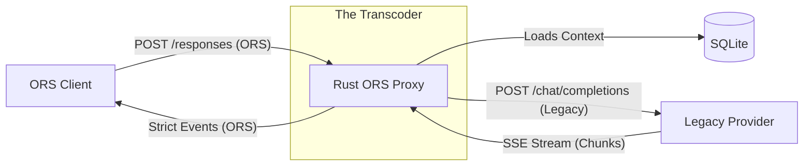

# Rust ORS Proxy 🦀

> **Get Ahead of the Curve: Adopt the Open Responses Standard Today.**

Why wait for providers to catch up? This high-performance Rust proxy allows you to build against the **Open Responses Specification (ORS)** *right now*, bridging your modern ORS client code to legacy "Chat Completions" providers like OpenAI, Ollama, and vLLM.

## Why ORS?

The era of "Chat Completions" is ending. Legacy APIs are loose, string-heavy, and fragile. The **Open Responses Specification (ORS)** is the future of agentic communication, offering:
- **Strict, Typed Events**: No more guessing if a chaotic JSON chunk is a text delta or a tool call.
- **Server-Managed State**: stop managing massive context windows on the client. The server handles history.
- **Unified Multimodal**: First-class support for Text, Images, and Tools in a single cohesive stream.

## Features

- **🚀 High Performance**: Built on **Rust**, **Tokio**, and **Axum** for minimal latency and maximum throughput.
- **🔄 Context Replay**: Built-in **SQLite** persistence automatically hydrates conversation history, allowing stateless clients to have stateful conversations.
- **🛠️ Full Tool Support**: Transcodes legacy `tool_calls` into strict, parseable `response.function_call` ORS items.
- **🖼️ Multimodal Ready**: Seamlessly maps ORS Image inputs to upstream legacy formats (OpenAI-compatible).
- **🛡️ Robust Transcoding**: Intelligent `SSE` buffering and `SseCodec` handle network fragmentation and upstream quirks, ensuring a perfect stream every time.

## Architecture



## Getting Started

### Prerequisites
- Rust (Cargo) installed.
- Access to an upstream provider (e.g., local Ollama instance or OpenAI API Key).

### specific Configuration

The proxy is configured via environment variables:

| Variable         | Description                              | Default                                      |
| ---------------- | ---------------------------------------- | -------------------------------------------- |
| `UPSTREAM_URL`   | The legacy endpoint to bridge to.        | `http://localhost:11434/v1/chat/completions` |
| `OPENAI_API_KEY` | (Optional) API Key if using OpenAI/vLLM. | `""`                                         |
| `DATABASE_URL`   | SQLite connection string.                | `sqlite://ors_proxy.db?mode=rwc`             |

### Running the Proxy

1. **Start your upstream provider** (e.g., `ollama serve`).

2. **Run the proxy**:
   ```bash
   export UPSTREAM_URL="http://localhost:11434/v1/chat/completions"
   cargo run
   ```

3. **Make an ORS Request**:
   ```bash
   curl -N -X POST http://localhost:3000/v1/responses \
     -H "Content-Type: application/json" \
     -d '{
       "model": "llama3",
       "stream": true,
       "input": [
         {
           "type": "message", 
           "role": "user", 
           "content": [{"type": "input_text", "text": "Why is Rust fast?"}]
         }
       ]
     }'
   ```

## Roadmap

- [x] **Core Streaming**: SSE Transcoding from Legacy Chunks to ORS Events.
- [x] **Persistence**: Conversation history and context replay.
- [x] **Tools**: Full Function Calling support.
- [x] **Images**: Multimodal input support.
- [ ] **Audio**: Support for audio input/output.
- [ ] **Authentication**: Middleware for proxy protection.

---

*Build the future, today.*
